# TivaC学习笔记（基于TM4C123GXL LaunchPad）

## 一、新建CCS工程

参考文章：https://blog.csdn.net/fang_dz999/article/details/112620483

### 1.点击File->New->CCS Project

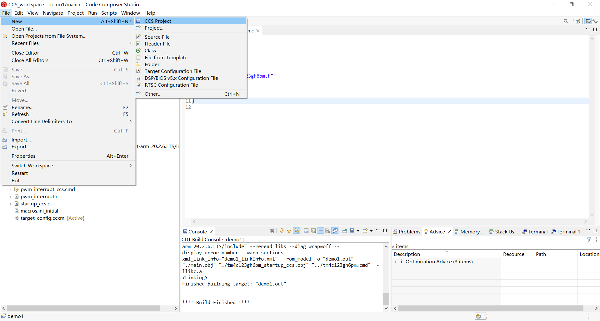

### 2.选择芯片并为工程命名后点击finish创建工程

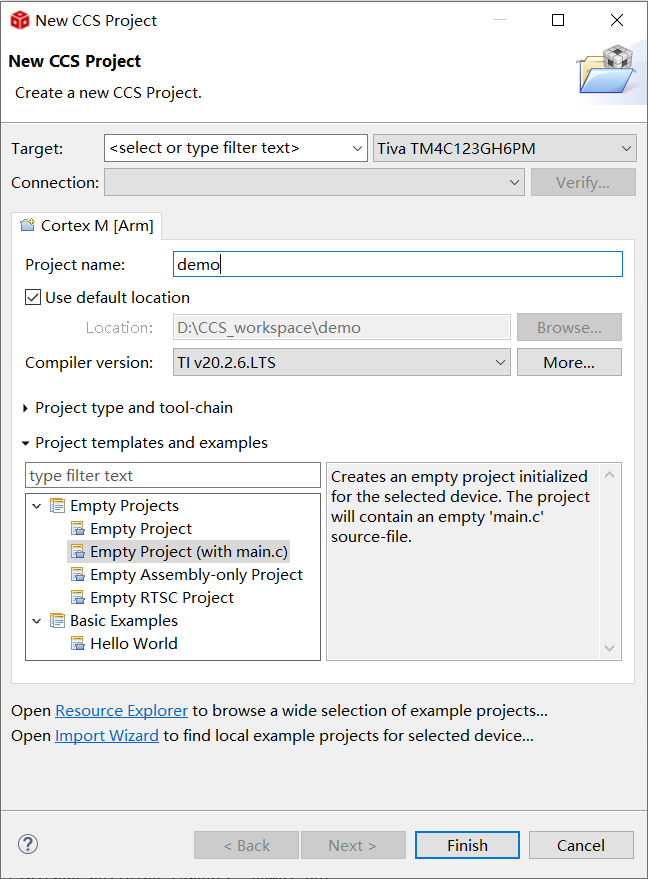

### 3.添加TivaWare

TivaWare是一个软件包，里面包含了一些列用于开发的库文件和软件示例，如果想用官方的一些库那就必须给工程添加这个软件包，TivaWare官方下载地址：https://www.ti.com/tool/SW-TM4C

#### 3.1选中工程，右键单击，点击Properties

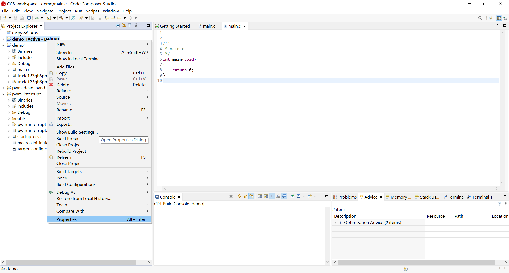

#### 3.2点击Include Options，添加新路径为TivaWare的安装路径

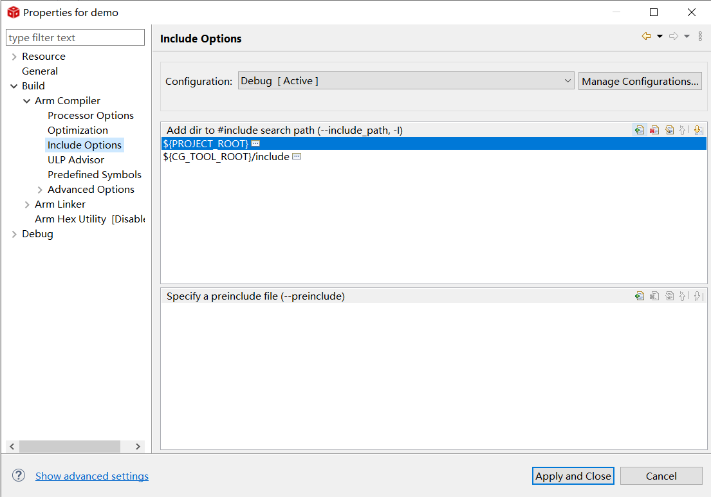

#### 3.3添加外设库

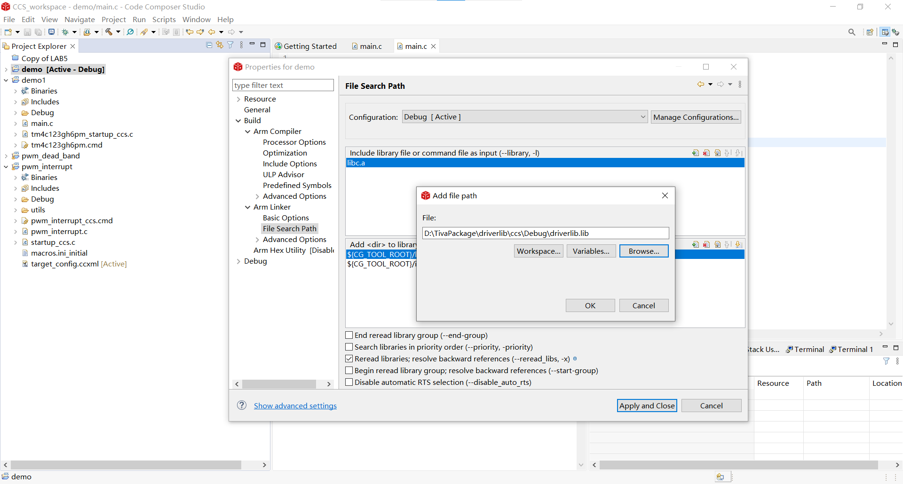

在上一步的操作上继续点击Arm Linker，点击File Search Path，添加driverlib.lib文件，这个文件在TivaWare目录下driverlib/ccs/Debug/driverlib.lib,至此新工程创建完成。

### 4.debug时出现：Unable to launch CCS debug-session based on current selection

#### 4.1选中工程，右键单击，点击Properties


#### 4.2点击General，设置Connection为Stellaris In-Circuit Debug Interface

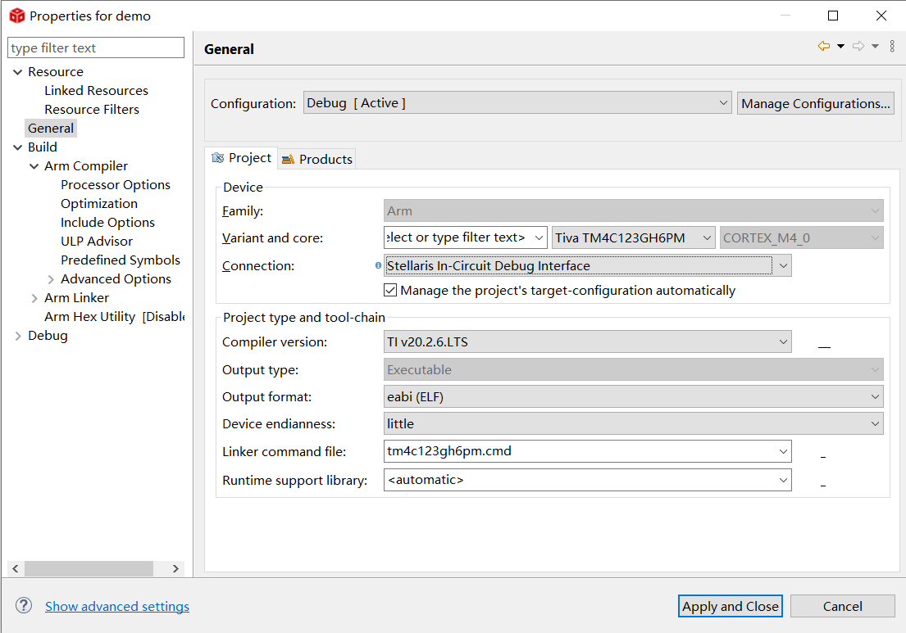

## 二、配置时钟

### 1.TM4C时钟源

|                   Clock                    |                             说明                             |
| :----------------------------------------: | :----------------------------------------------------------: |
|   Precision Internal Oscillator (PIOSC)    | 这是TM4C内部的一个内部振荡器，其频率为16MHz，精度为1%，可以用来驱动PLL。PIOSC可配置为ADC时钟源以及UART和SSI的波特率时钟 |
|           Main Oscillator (MOSC)           | 这是TM4C的主振荡器，需要把外部的晶振接到**OSC**引脚上。晶振频率需要为4MHz和25MHz之间的任意的频率。MOSC也可以用来驱动PLL，但此时的频率需要在5MHz-25MHz之间的支持的频率。同时MOSC也是USB PLL的时钟来源 |
| Low-Frequency Internal Oscillator (LFIOSC) | 这是TM4C内部的低频振荡器，低频内部振荡器适用于深度睡眠省电模式，它的频率是会改变的，范围在10KHz-90KHz之间，标准值30KHz。 |
|      Hibernation Module Clock Source       | 这是休眠模块时钟源，由连接到**XOSC**引脚的32.768KHz的晶振提供，休眠模块时钟源旨在为系统提供实时时钟源。 |

### 2.时钟树

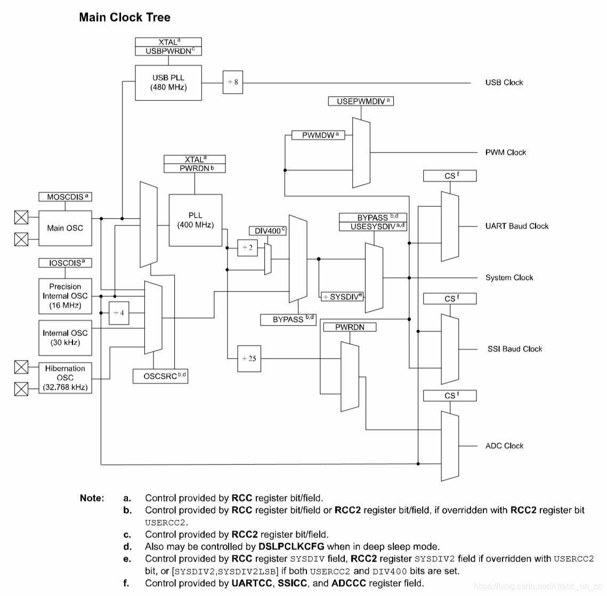

​		从时钟树里面可以看到，MOSC和PIOSC可以驱动PLL倍频，PLL的输出为400MHz，而TM4C123G最高主频是80MHz，所以PLL的输出并不能直接用作系统时钟，而需要分频后才能作为系统时钟使用，同时可以看出PLL输出时已经被二分频一次了，所以配置PLL为系统时钟时最小的预分频系数为2.5。

​	时钟的具体配置可以查看数据手册221页

### 3.一些与时钟相关的函数

```c
//系统时钟配置函数
void SysCtlClockSet(uint32_t ui32Config)  
 
示例：
//使用外部晶振，频率为16MHz作为OSC，并使能PLL，同时设置预分频系数为2.5，得到系统时钟为80MHz
SysCtlClockSet(SYSCTL_SYSDIV_2_5|SYSCTL_USE_PLL|SYSCTL_XTAL_16MHZ|SYSCTL_OSC_MAIN);
//该函数以及所用到的宏都在头文件sysctl.h中

//获取系统时钟函数
uint32_t SysCtlClockGet(void)
//示例：
uint32_t clk = SysCtlClockGet();

//延时函数
void SysCtlDelay(uint32_t ui32Count)
//该函数延时时间为:ui32Count*3*系统时钟周期，系统时钟周期=1/SysCtlClockGet()，即延时间：ui32Count*3/SysCtlClockGet()
//延迟1s
SysCtlDelay(SysCtlClockGet()/3);

```

### 4.注：一些直接操作硬件寄存器的函数

```c
#define HWREG(x) \

        (*((volatile uint32_t *)(x)))

#define HWREGH(x) \

        (*((volatile uint16_t *)(x)))

#define HWREGB(x) \

        (*((volatile uint8_t *)(x)))

#define HWREGBITW(x, b) \

        HWREG(((uint32_t)(x) & 0xF0000000) | 0x02000000 | \

              (((uint32_t)(x) & 0x000FFFFF) << 5) | ((b) << 2))

#define HWREGBITH(x, b) \

        HWREGH(((uint32_t)(x) & 0xF0000000) | 0x02000000 | \

               (((uint32_t)(x) & 0x000FFFFF) << 5) | ((b) << 2))

#define HWREGBITB(x, b) \

        HWREGB(((uint32_t)(x) & 0xF0000000) | 0x02000000 | \

               (((uint32_t)(x) & 0x000FFFFF) << 5) | ((b) << 2))
```

## 三、GPIO学习

### 1.GPIO的读取、写入

#### 1.1相关函数

```c
void SysCtlPeripheralEnable(uint32_t ui32Peripheral);
/*  功能：外设时钟使能函数，在使用外设时，初始化系统时钟后需要调用这个函数使能相应的外设
	参数：uint32_t ui32Peripheral：需要使能的外设，例如需要使能的外设为GPIO（例如SYSCTL_PERIPH_GPIOF）
	说明：从使能操作开始到完成需要经过五个时钟周期，在此期间不可访问外设，否则会出现总线错误。
	例子：SysCtlPeripheralEnable(SYSCTL_PERIPH_GPIOF);//使能GPIOF端口
*/

void GPIOPinTypeGPIOOutput(uint32_t ui32Port, uint8_t ui8Pins);
/*	功能：配置引脚为输出模式
	参数：
	uint32_t ui32Port ：GPIO口的基地址
	uint8_t ui8Pins：引脚（例如GPIO_PIN_1）
	例子：GPIOPinTypeGPIOOutput(GPIO_PORTF_BASE,GPIO_PIN_1|GPIO_PIN_2|GPIO_PIN_3);//配置PF1、PF2、PF3为输出模式
*/

void GPIOPinTypeGPIOInput(uint32_t ui32Port, uint8_t ui8Pins);
/*	功能：配置引脚为输入模式
	参数：
	uint32_t ui32Port ：GPIO口的基地址
	uint8_t ui8Pins：引脚（例如GPIO_PIN_1）
	例子：GPIOPinTypeGPIOOutput(GPIO_PORTF_BASE,GPIO_PIN_1|GPIO_PIN_2|GPIO_PIN_3);//配置PF1、PF2、PF3为输入模式
*/

void GPIOPinWrite(uint32_t ui32Port, uint8_t ui8Pins, uint8_t ui8Val);
/*	功能：写值到指定引脚.
	参数：
	uint32_t ui32Port：GPIO口的基地址
	uint8_t ui8Pins： 引脚，每一位对应不同的引脚，各个引脚对应的二进制位如下，值为1表示这一位对应的引脚用于输出
	uint8_t ui8Val： 每一个二进制位的值就是该二进制位对应引脚的输出值，1表示高电平，0表示低电平
	例子：GPIOPinWrite(GPIO_PORTF_BASE, GPIO_PIN_1|GPIO_PIN_2|GPIO_PIN_3, 2);//PF1输出为高电平，PF2、PF3为低电平
	说明：如果某个GPIO引脚已经被配置成了输入模式，那么这个函数的写操作对于这个引脚是没有作用的
*/

int32_t GPIOPinRead(uint32_t ui32Port, uint8_t ui8Pins);
/*	功能：读取指定GPIO指定引脚的输入
	参数：
	ui32Port： GPIO基地址
	ui8Pins：每一位表示对应的引脚
	例子：int32_t state=GPIOPinRead(GPIO_PORTF_BASE, GPIO_PIN_1);//读取PF1的电平状态
	说明：返回值中只有末尾八位是有效的，且这八位代表八个引脚，每一位的值代表对应引脚的电平状态，0为低电平，1为高电平
*/

void GPIODirModeSet(uint32_t ui32Port, uint8_t ui8Pins,uint32_t ui32PinIO);
/*	功能：设置GPIO引脚的输入输出方向
	参数：
	ui32Port： GPIO基地址
	ui8Pins：GPIO引脚
	uint32_t ui32PinIO：GPIO引脚的输入输出方向 GPIO_DIR_MODE_IN 、GPIO_DIR_MODE_OUT、GPIO_DIR_MODE_HW
	例子：GPIODirModeSet(GPIO_PORTF_BASE,GPIO_PIN_4, GPIO_DIR_MODE_IN);//设置PF4引脚为输入
	说明：GPIOPinTypeGPIOInput、GPIOPinTypeGPIOOutput两个函数内部都调用了GPIODirModeSet
*/

void GPIOPadConfigSet(uint32_t ui32Port, uint8_t ui8Pins,uint32_t ui32Strength, uint32_t ui32PadType);
/*	功能：IO口设置
	参数：
	ui32Port： GPIO基地址
	ui8Pins：GPIO引脚
	uint32_t ui32Strength：IO口电流强度，可选GPIO_STRENGTH_2MA、GPIO_STRENGTH_4MA等等
	uint32_t ui32PadType：设置推挽，上下拉等等，可选GPIO_PIN_TYPE_STD、GPIO_PIN_TYPE_STD_WPU等等
	例子：GPIOPadConfigSet(GPIO_PORTF_BASE,GPIO_PIN_4,GPIO_STRENGTH_2MA, GPIO_PIN_TYPE_STD_WPU);
		//设置PF4电流强度为2mA，推挽模式并且内部上拉
	说明：GPIOPinTypeGPIOInput、GPIOPinTypeGPIOOutput两个函数内部其实是调用了GPIODirModeSet、GPIOPadConfigSet实现			的，但是这两个函数设置IO口时默认为推挽模式，且无上下拉，若需更改，需要自己调用GPIOPadConfigSet来设置

*/
	
```

#### 1.2示例程序

```c
/*
烧录程序后，按下按键SW1可以切换灯的颜色
*/
#include <stdio.h>
#include <stdint.h>
#include <stdbool.h>
#include "inc/tm4c123gh6pm.h"
#include "inc/hw_memmap.h"
#include "driverlib/debug.h"
#include "driverlib/fpu.h"
#include "driverlib/gpio.h"
#include "driverlib/sysctl.h"
int main(void)
{
    int32_t state=1;
    //配置系统时钟，使用外部晶振驱动PLL，分频系数2.5，系统时钟80Mhz
    SysCtlClockSet(SYSCTL_SYSDIV_2_5|SYSCTL_USE_PLL|SYSCTL_XTAL_16MHZ|SYSCTL_OSC_MAIN);
    SysCtlPeripheralEnable(SYSCTL_PERIPH_GPIOF);       //使能外设
    //配置PF1、PF2、PF3引脚为输出模式
    GPIOPinTypeGPIOOutput(GPIO_PORTF_BASE,GPIO_PIN_1|GPIO_PIN_2|GPIO_PIN_3);
    GPIOPinWrite(GPIO_PORTF_BASE, GPIO_PIN_1|GPIO_PIN_2|GPIO_PIN_3, 0);
    //配置PF4引脚为输入，推挽模式，内部上拉
    GPIODirModeSet(GPIO_PORTF_BASE,GPIO_PIN_4, GPIO_DIR_MODE_IN);
    GPIOPadConfigSet(GPIO_PORTF_BASE,GPIO_PIN_4,GPIO_STRENGTH_2MA, GPIO_PIN_TYPE_STD_WPU);

    while(1)
    {
        //读取GPIO状态，检测按键sw1是否按下
        if(!(GPIOPinRead(GPIO_PORTF_BASE, GPIO_PIN_4)==GPIO_PIN_4))
        {
            SysCtlDelay(SysCtlClockGet()*0.01/3);//延时消抖
            if(!(GPIOPinRead(GPIO_PORTF_BASE, GPIO_PIN_4)==GPIO_PIN_4))
                state=state*2;
            if(state>8)
                state=2;
        }
        switch(state)
        {
            //切换点亮的灯的颜色
            case 2: GPIOPinWrite(GPIO_PORTF_BASE, GPIO_PIN_1|GPIO_PIN_2|GPIO_PIN_3, 2);break;
            case 4: GPIOPinWrite(GPIO_PORTF_BASE, GPIO_PIN_1|GPIO_PIN_2|GPIO_PIN_3, 4);break;
            case 8: GPIOPinWrite(GPIO_PORTF_BASE, GPIO_PIN_1|GPIO_PIN_2|GPIO_PIN_3, 8);break;
            default:break;
        }
    }

}
```

### 2.GPIO中断

#### 2.1相关函数

参考文章：https://blog.csdn.net/SStegosaurus/article/details/108161307

```c
void GPIOIntTypeSet(uint32_t ui32Port, uint8_t ui8Pins,uint32_t ui32IntType);
/*  
功能：设置指定引脚的中断触发类型.
参数:
ui32Port：GPIO口的基地址
ui8Pins：GPIO引脚
ui32IntType：中断触发的类型，可选GPIO_FALLING_EDGE、GPIO_RISING_EDGE、GPIO_BOTH_EDGES、GPIO_LOW_LEVEL等等
*/

void GPIOIntRegister(uint32_t ui32Port, void (*pfnIntHandler)(void))
/*	
功能：注册GPIO外部中断的中断服务函数
参数:
	ui32Port ：GPIO口的基地址
	pfnIntHandler： 是指向中断服务函数入口地址的指针。中断服务函数可以自行定义
*/
 
void GPIOIntEnable(uint32_t ui32Port, uint32_t ui32IntFlags)
/*
功能：使能指定GPIO中断的中断源。
参数:
ui32Port ：GPIO口的基地址。
ui32IntFlags： 中断源对应掩码
*/  
    
void IntEnable(uint32_t ui32Interrupt)
/*
功能：在中断控制器中使能一个中断
参数:
ui32Interrupt 指定的中断
*/   
    
bool IntMasterEnable(void)
/*
功能：使能处理器中断，即允许处理器响应某个中断.
参数：无
*/ 
    
void GPIOIntClear(uint32_t ui32Port, uint32_t ui32IntFlags)
/*
功能：清除指定中断源的中断标志位
参数:
ui32Port ：GPIO口的基地址
ui32IntFlags ：被清除的中断源中断标志位
说明：发生中断后，对应的中断标志位置1，进入中断服务函数，在服务函数中务必清除中断标志。配置中断后最好也调用一次该函数
*/
    
void IntPrioritySet(uint32_t ui32Interrupt,uint8_t ui8Priority)
/*
功能：设置中断的优先级
参数:
ui32Interrupt 指定的中断
ui8Priority ：中断优先级，最低为0xE0，最高为0x00
*/
    
uint32_t GPIOIntStatus(uint32_t ui32Port, bool bMasked)
/*
功能：读取指定GPIO口的中断状态
参数：
ui32Port： GPIO口的基地址.
bMasked： 布尔变量，用于指定返回值屏蔽的中断状态或原始的中断状态
说明：GPIO 屏蔽后的中断状态寄存器(GPIO Masked Interrupt Status, GPIOMIS)，GPIO原始中断状态寄存器(GPIO Raw Interrupt Status ，GPIORIS)。GPIORIS反应原始的中断状态，即引脚产生中断，则该寄存器相应的位即被置1，无论该引脚的中断有没有被屏蔽。而对于GPIOMIS，如果对应引脚的中断被屏蔽，即使引脚产生中断，该寄存器对应的位也不会被置1，仍为0。bmasked作用就是决定返回值是GPIORIS还是GPIOMIS。
*/
```

#### 2.2示例程序

```c
/*
烧录程序后，按下按键SW1可以切换灯的颜色
*/
#include <stdio.h>
#include <stdint.h>
#include <stdbool.h>
#include "inc/tm4c123gh6pm.h"
#include "inc/hw_memmap.h"
#include "driverlib/debug.h"
#include "driverlib/fpu.h"
#include "driverlib/gpio.h"
#include "driverlib/sysctl.h"
#include "driverlib/interrupt.h"
//按键sw1中断服务函数
void key_handler();
volatile uint16_t led=1;
int main(void)
{
    //配置系统时钟，使用外部晶振驱动PLL，分频系数2.5，系统时钟80Mhz
    SysCtlClockSet(SYSCTL_SYSDIV_2_5|SYSCTL_USE_PLL|SYSCTL_XTAL_16MHZ|SYSCTL_OSC_MAIN);
    SysCtlPeripheralEnable(SYSCTL_PERIPH_GPIOF);       //使能外设

    //配置PF1、PF2、PF3引脚为输出模式
    GPIOPinTypeGPIOOutput(GPIO_PORTF_BASE,GPIO_PIN_1|GPIO_PIN_2|GPIO_PIN_3);
    GPIOPinWrite(GPIO_PORTF_BASE, GPIO_PIN_1|GPIO_PIN_2|GPIO_PIN_3, 0);

    //配置PF4引脚为输入，推挽模式，内部上拉
    GPIODirModeSet(GPIO_PORTF_BASE,GPIO_PIN_4, GPIO_DIR_MODE_IN);
    GPIOPadConfigSet(GPIO_PORTF_BASE,GPIO_PIN_4,GPIO_STRENGTH_2MA, GPIO_PIN_TYPE_STD_WPU);

    //配置PF4引脚为外部中断引脚，下降沿触发
    GPIOIntTypeSet(GPIO_PORTF_BASE, GPIO_PIN_4, GPIO_FALLING_EDGE);
    //配置中断服务函数入口
    GPIOIntRegister(GPIO_PORTF_BASE, key_handler);
    //使能GPIOF中断
    GPIOIntEnable(GPIO_PORTF_BASE, GPIO_PIN_4);
    //使能中断控制器的GPIOF中断
    IntEnable(INT_GPIOF);
    //使能处理器中断
    IntMasterEnable();
    //清除中断标志
    GPIOIntClear(GPIO_PORTF_BASE, GPIO_PIN_4);
    //配置中断优先级
    IntPrioritySet(INT_GPIOF, 0xE0);

    while(1)
    {
        GPIOPinWrite(GPIO_PORTF_BASE, GPIO_PIN_1|GPIO_PIN_2|GPIO_PIN_3, led);
    }
}
void key_handler()
{
    uint32_t status;
    //获取中断标志位
    status=GPIOIntStatus(GPIO_PORTF_BASE, true);

    GPIOIntClear(GPIO_PORTF_BASE, status);
    if(status==GPIO_PIN_4)
    {
        if(led<8)
        led=led*2;
        else
        led=2;
    }
}
```

## 四、UART学习

### 1.TM4C123G串口引脚映射表

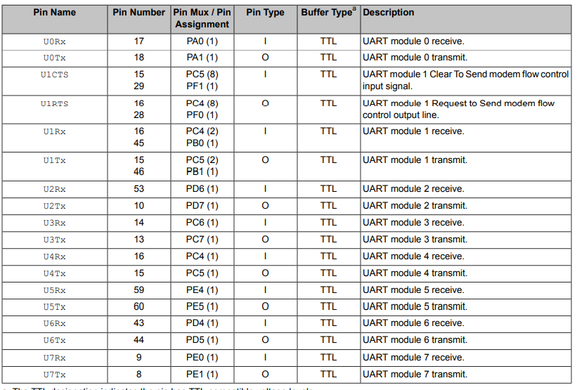

### 2.相关函数

```c
void UARTClockSourceSet(uint32_t ui32Base, uint32_t ui32Source)
/*
功能：配置串口波特时钟源
参数：
	uint32_t ui32Base：串口基地址
	uint32_t ui32Source：串口波特时钟源可以选系统时钟或者PIOSC，宏分别为UART_CLOCK_SYSTEM、UART_CLOCK_PIOSC
*/

void UARTConfigSetExpClk(uint32_t ui32Base, uint32_t ui32UARTClk,uint32_t ui32Baud, uint32_t ui32Config)
/*
功能：配置串口参数
参数：
	uint32_t ui32Base：串口基地址
	uint32_t ui32UARTClk：串口波特时钟频率，如果串口波特时钟使用系统时钟，这个参数可以由SysCtlClockGet()函数获取，如果串口	 波特时钟由PIOSC提供，则这里为16000000
	uint32_t ui32Baud：串口波特率
	uint32_t ui32Config：数据位、停止位、奇偶校验
说明：这个函数调用后会先关闭串口，配置完成后使能串口
*/
    
void UARTFIFOLevelSet(uint32_t ui32Base, uint32_t ui32TxLevel,uint32_t ui32RxLevel)
/*
功能：设置串口FIFO深度
参数：
    uint32_t ui32Base：串口基地址
	uint32_t ui32TxLevel：串口发送FIFO深度，以字节为单位
	uint32_t ui32RxLevel：串口接收FIFO深度，以字节为单位
说明：TM4C123G串口的FIFO深度为16，配置时可以选1/8、2/8、4/8、6/8、7/8倍的FIFO深度，即深度可设置为2、4、8、12、14，以接收	 FIFO设置为例，参数uint32_t ui32RxLevel可选择：UART_FIFO_RX1_8、UART_FIFO_RX2_8、UART_FIFO_RX4_8、			 UART_FIFO_RX6_8、UART_FIFO_RX7_8，分别代表1/8、2/8、4/8、6/8、7/8倍的FIFO深度
*/
    
void UARTFIFOEnable(uint32_t ui32Base)
/*
功能：使能串口FIFO
参数：
	uint32_t ui32Base：串口基地址
*/
    
bool UARTCharsAvail(uint32_t ui32Base)
/*
功能：查看接收FIFO中是否有字符
参数：
	uint32_t ui32Base：串口基地址
返回值：若FIFO中有字符返回1，没有字符返回0
*/ 

bool UARTSpaceAvail(uint32_t ui32Base)
/*
功能：查看发送FIFO中是否有空闲空间
参数：
	uint32_t ui32Base：串口基地址
返回值：若FIFO中有空闲空间返回1，没有字符返回0
*/
    
int32_t UARTCharGetNonBlocking(uint32_t ui32Base)
/*
功能：从串口接收FIFO中读取一个字符，非阻塞函数
参数：
	uint32_t ui32Base：串口基地址
说明：这个函数可以配合UARTCharsAvail()函数使用，在确认接收FIFO中有数据后再读取，此时返回的字符数据类型会被转化为int32_t类型，如果FIFO中没有数据，使用这个函数读取时会直接返回-1，接着执行下面的程序，不等待
*/

int32_t UARTCharGet(uint32_t ui32Base)
/*
功能：从串口接收FIFO中读取一个字符，阻塞函数
参数：
	uint32_t ui32Base：串口基地址
说明：若接收FIFO中有数据，则读取一个字符并返回，返回的字符数据类型会被转化为int32_t类型，如果FIFO中没有数据，这个函数会一直等		待，阻塞程序，直到FIFO中有数据，读取数据并返回，继续后面的程序
*/
 
bool UARTCharPutNonBlocking(uint32_t ui32Base, unsigned char ucData)
/*
功能：将字符放入发送FIFO,非阻塞函数
参数：
	uint32_t ui32Base：串口基地址
	unsigned char ucData：需要发送的字符（即需要放入发送FIFO的字符）
说明：这个函数最可以配合UARTSpaceAvail()函数使用，在确认发送FIFO中有空闲空间后将字符放入FIFO中并返回1，如果FIFO中没有空闲空间，使用这个函数发送时会直接返回0，接着执行下面的程序，不等待
*/  
    
void UARTCharPut(uint32_t ui32Base, unsigned char ucData)
/*
功能：将字符放入发送FIFO,阻塞函数
参数：
	uint32_t ui32Base：串口基地址
	unsigned char ucData：需要发送的字符（即需要放入发送FIFO的字符）
说明：发送FIFO中有空闲空间时将字符放入FIFO中，如果FIFO中没有空闲空间，使用这个函数读取时会一直等待，阻塞程序，直到发送FIFO中有		空闲空间，将数据放入FIFO并返回，继续后面的程序
*/ 
    
void UARTIntRegister(uint32_t ui32Base, void (*pfnHandler)(void))
/*	
功能：注册串口中断的中断服务函数
参数:
	uint32_t ui32Base：串口基地址
	pfnIntHandler：是指向中断服务函数入口地址的指针。中断服务函数可以自行定义
*/

void UARTIntEnable(uint32_t ui32Base, uint32_t ui32IntFlags)
/*	
功能：注册串口中断使能函数
参数:
	uint32_t ui32Base：串口基地址
	uint32_t ui32IntFlags： 中断源掩码，比如串口接收中断UART_INT_RX和接收超时中断UART_INT_RT
说明：串口的接收中断其实就是串口的接收FIFO溢出中断，如果不开启FIFO，那么接收中断将收到一个字符就触发一次，接收超时中断是指当串口	接收到一个字符后开始定时，若超过一定时间没有接收到下一个字符，同样会触发中断，这个中断就是接收超时中断
*/
 
uint32_t UARTIntStatus(uint32_t ui32Base, bool bMasked)
/*
功能：读取指定串口的中断状态
参数：
	uint32_t ui32Base：串口基地址
	bool bMasked： 布尔变量，用于指定返回值屏蔽的中断状态或原始的中断状态
说明：bMasked为true返回屏蔽的中断状态，为false返回原始的中断状态
*/

void UARTIntClear(uint32_t ui32Base, uint32_t ui32IntFlags)
/*
功能：清除指定中断源的中断标志位
参数:
	uint32_t ui32Base：串口基地址
	ui32IntFlags：被清除的中断源中断屏蔽位
说明：发生中断后，对应的中断标志位置1，进入中断服务函数，在服务函数中务必清除中断标志。配置中断后最好也调用一次该函数
*/
 void UARTStdioConfig(uint32_t ui32PortNum, uint32_t ui32Baud, uint32_t ui32SrcClock)
 /*
功能：配置串口用于控制台输出，
参数:
	uint32_t ui32PortNum：用于控制台输出的串口编号，在UART0-7八个串口中，只有UART0，UART1，UART2可以配置用于控制台输出，即该参数只能填写0，1或者2，
	uint32_t ui32Baud ：串口波特率
	uint32_t ui32SrcClock：串口波特时钟源的频率
*/
void UARTprintf(const char *pcString, ...)
/*
功能：将数据格式化输出
参数:
	const char *pcString：格式化输出的数据流
说明：该函数相当于重定向printf函数，重定向到的串口号由UARTStdioConfig()函数的ui32PortNum参数决定，要使用该函数需要使用UARTStdioConfig()函数配置串口，该函数支持的打印（输出）类型有%c,%d,%p,%s,%u,%x和%X，不支持浮点数打印！！不支持浮点数打印！！不支持浮点数打印！！
*/
```

### 3.示例程序

```c

/**
 * main.c
 */

/*
 * 程序中使用的UART0和板子上的上传程序的USB线是连接在一起的，只需接到电脑上就可以使用这个串口，上传程序后，板载led会闪烁，同时若用串口调试助手向板子发送字符，板子会将发送的字符发送回来
 */
#include <stdio.h>
#include <stdint.h>
#include <stdbool.h>
#include "inc/tm4c123gh6pm.h"
#include "inc/hw_memmap.h"
#include "driverlib/debug.h"
#include "driverlib/fpu.h"
#include "driverlib/gpio.h"
#include "driverlib/sysctl.h"
#include "driverlib/uart.h"
#include "utils/uartstdio.h"
#include "driverlib/interrupt.h"
#include "driverlib/pin_map.h"
#include "driverlib/rom_map.h"
//串口中断服务函数
void UART0_Handler();

int main(void)
{
    //配置系统时钟，使用外部晶振驱动PLL，分频系数2.5，系统时钟80Mhz
    SysCtlClockSet(SYSCTL_SYSDIV_2_5|SYSCTL_USE_PLL|SYSCTL_XTAL_16MHZ|SYSCTL_OSC_MAIN);
    //使能外设
    SysCtlPeripheralEnable(SYSCTL_PERIPH_GPIOA);
    SysCtlPeripheralEnable(SYSCTL_PERIPH_GPIOF);
    SysCtlPeripheralEnable(SYSCTL_PERIPH_UART0);
    //配置PF2引脚，这个引脚连接到了板载LED
    GPIOPinTypeGPIOOutput(GPIO_PORTF_BASE,GPIO_PIN_2);
    GPIOPinWrite(GPIO_PORTF_BASE, GPIO_PIN_2, 0);
    //将PA0、PA1引脚配置成串口引脚
    GPIOPinConfigure(GPIO_PA0_U0RX);//RX=GPIO_PIN_0
    GPIOPinConfigure(GPIO_PA1_U0TX);//TX=GPIO_PIN_1
    GPIOPinTypeUART(GPIO_PORTA_BASE, GPIO_PIN_0 | GPIO_PIN_1);
    //配置串口波特时钟源及参数
    UARTClockSourceSet(UART0_BASE, UART_CLOCK_SYSTEM);
    UARTConfigSetExpClk( UART0_BASE, SysCtlClockGet(),115200,  	        UART_CONFIG_WLEN_8|UART_CONFIG_STOP_ONE|UART_CONFIG_PAR_NONE);
    //使能FIFO并设置FIFO深度
    UARTFIFOEnable(UART0_BASE);
    UARTFIFOLevelSet(UART0_BASE, UART_FIFO_RX1_8,UART_FIFO_TX1_8);
    //配置串口中断
    UARTIntRegister(UART0_BASE, UART0_Handler);
    UARTIntEnable(UART0_BASE, UART_INT_RX|UART_INT_RT);//开启串口接收中断和接收超时中断
    UARTIntClear(UART0_BASE, UART0_BASE);
    //启用串口0的中断并开启处理器中断控制器
    IntEnable(INT_UART0);
    IntMasterEnable();
    //使能串口
    UARTEnable( UART0_BASE);

    while(1)
    {
        GPIOPinWrite(GPIO_PORTF_BASE, GPIO_PIN_2, 4);
        SysCtlDelay(SysCtlClockGet()*0.5/3);
        GPIOPinWrite(GPIO_PORTF_BASE, GPIO_PIN_2, 0);
        SysCtlDelay(SysCtlClockGet()*0.5/3);
    }

}

void UART0_Handler()
{
    int32_t rxbuf;
    //读取中断状态
    uint32_t status=UARTIntStatus(UART0_BASE,true);
    //清除中断标志位
    UARTIntClear(UART0_BASE, status);
    //检查FIFO中是否有字符，若有，读取出来并发送
    while(UARTCharsAvail(UART0_BASE))
    {
        rxbuf=UARTCharGetNonBlocking(UART0_BASE);
        UARTCharPutNonBlocking(UART0_BASE, rxbuf);
    }
}
```

## 五、定时器学习

参考文章：https://blog.csdn.net/weixin_56003594/article/details/125662058

### 1.资源简介

TM4C123G有两种定时器，一种为16/32bit的，一种是32/64bit的，两种定时器各有六个，对于每个定时器来说，它可以单独以较大的bit位作为一个定时器工作，也可以拆分为两个较小的bit位的定时器分别工作。比如对于16/32bit位的定时器，可以以32bit位的定时器工作，也可以以两个16bit的定时器A和B分别工作。当定时被拆分为A、B两个使用时，A、B可以独立配置为各个模式的任意组合。

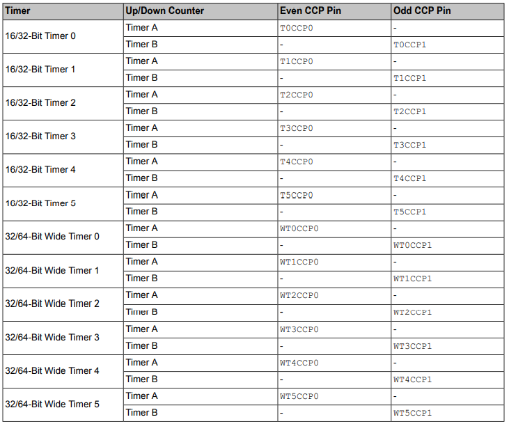

### 2.定时器的工作模式和引脚资源

定时器可以配置的工作模式如下图

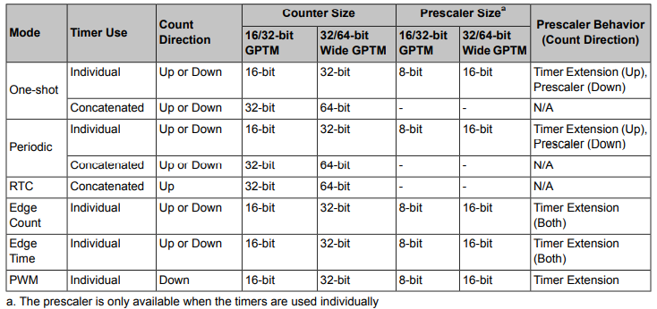

**从图中可以看出，定时器的预分频器与STM32的明显不同，TM4C123G中定时器的预分频器的功能根据定时器的配置模式而改变，当定时器没有被拆分为A、B两个时预分频器是没有作用的；在单次计时和周期计时模式下，当定时器是向上计数时，预分频器作为定时器扩展，当向下计数时，预分频器作预分频；而在边沿计数和边沿计时以及PWM模式下，预分频器都只做定时器扩展，且作为定时器扩展时扩展到了定时器的高位部分，16/32bit的定时器预分频器为8位，32/64bit的定时器预分频器为16位，当预分频器作为定时器扩展时，这两种定时器分别变为24位和48位的定时器，且高8位部分和高16位部分由预分频器构成**

定时器捕获模式和PWM模式下的的引脚映射

| Pin Name | Pin Mux / Pin  Assignment |                 Description                  |
| :------: | :-----------------------: | :------------------------------------------: |
|  T0CCP0  |          PB6/PF0          |   16/32-Bit Timer 0 Capture/Compare/PWM 0    |
|  T0CCP1  |          PB7/PF1          |   16/32-Bit Timer 0 Capture/Compare/PWM 1    |
|  T1CCP0  |          PF2/PB4          |   16/32-Bit Timer 1 Capture/Compare/PWM 0    |
|  T1CCP1  |          PF3/PB5          |   16/32-Bit Timer 1 Capture/Compare/PWM 1    |
|  T2CCP0  |          PF4/PB0          |   16/32-Bit Timer 2 Capture/Compare/PWM 0    |
|  T2CCP1  |            PB1            |   16/32-Bit Timer 2 Capture/Compare/PWM 1    |
|  T3CCP0  |            PB2            |   16/32-Bit Timer 3 Capture/Compare/PWM 0    |
|  T3CCP1  |            PB3            |   16/32-Bit Timer 3 Capture/Compare/PWM 1    |
|  T4CCP0  |            PC0            |   16/32-Bit Timer 4 Capture/Compare/PWM 0    |
|  T4CCP1  |            PC1            |   16/32-Bit Timer 4 Capture/Compare/PWM 1    |
|  T5CCP0  |            PC2            |   16/32-Bit Timer 5 Capture/Compare/PWM 0    |
|  T5CCP1  |            PC3            |   16/32-Bit Timer 5 Capture/Compare/PWM 1    |
| WT0CCP0  |            PC4            | 32/64-Bit Wide Timer 0 Capture/Compare/PWM 0 |
| WT0CCP1  |            PC5            | 32/64-Bit Wide Timer 0 Capture/Compare/PWM 1 |
| WT1CCP0  |            PC6            | 32/64-Bit Wide Timer 1 Capture/Compare/PWM 0 |
| WT1CCP1  |            PC7            | 32/64-Bit Wide Timer 1 Capture/Compare/PWM 1 |
| WT2CCP0  |            PD0            | 32/64-Bit Wide Timer 2 Capture/Compare/PWM 0 |
| WT2CCP1  |            PD1            | 32/64-Bit Wide Timer 2 Capture/Compare/PWM 1 |
| WT3CCP0  |            PD2            | 32/64-Bit Wide Timer 3 Capture/Compare/PWM 0 |
| WT3CCP1  |            PD3            | 32/64-Bit Wide Timer 3 Capture/Compare/PWM 1 |
| WT4CCP0  |            PD4            | 32/64-Bit Wide Timer 4 Capture/Compare/PWM 0 |
| WT4CCP1  |            PD5            | 32/64-Bit Wide Timer 4 Capture/Compare/PWM 1 |
| WT5CCP0  |            PD6            | 32/64-Bit Wide Timer 5 Capture/Compare/PWM 0 |
| WT5CCP1  |            PD7            | 32/64-Bit Wide Timer 5 Capture/Compare/PWM 1 |

### 3.基本定时模式

ps：如果拆分为A，B两个定时器，需要分别配置

#### 3.1相关函数

```c
void TimerClockSourceSet(uint32_t ui32Base, uint32_t ui32Source)
/*
功能：设置定时器时钟源
参数：
	uint32_t ui32Base：定时器基地址
	uint32_t ui32Source：定时器时钟源，可以选系统时钟(TIMER_CLOCK_SYSTEM)或者PIOSC(TIMER_CLOCK_PIOSC)
*/

void TimerConfigure(uint32_t ui32Base, uint32_t ui32Config)
/*
功能：配置定时器工作模式
参数：
	uint32_t ui32Base：定时器基地址
	uint32_t ui32Config：定时器工作模式对应的掩码
*/
    
void TimerPrescaleSet(uint32_t ui32Base, uint32_t ui32Timer,uint32_t ui32Value)
/*
功能：设置定时器时钟预分频系数
参数：
	uint32_t ui32Base：定时器基地址
	uint32_t ui32Timer：定时器A或定时器B或两个一起，(TIMER_A、TIMER_B,or TIMER_BOTH)，若定时器未拆分，只需填TIMER_A
	uint32_t ui32Value：预分频系数
说明：对于16/32bit的定时器，其预分频器为8位，预分频系数只能设置为0~255；对于32/64bit的定时器，其预分频器为16位，预分频系数可 	    设置为0~65535，这个函数只对拆分后的定时器起作用，没有拆分使用的定时器无法预分频
*/
    
void TimerLoadSet(uint32_t ui32Base, uint32_t ui32Timer,uint32_t ui32Value)
/*
功能：设置定时器装载值
参数：
	uint32_t ui32Base：定时器基址
	uint32_t ui32Timer：定时器A或定时器B或两个一起，(TIMER_A、TIMER_B,or TIMER_BOTH)，若定时器未拆分，只需填TIMER_A
	uint32_t ui32Value：定时器装载值
说明;这个函数可以设置拆分和未拆分的16/32bit定时器的装载值，也可设置拆分后的32/64bit的定时器的装载值，但是未拆分使用的32/64bit
定时器的装载值不能使用这个函数设置，要使用TimerLoadSet64()函数	
*/
    
void TimerLoadSet64(uint32_t ui32Base, uint64_t ui64Value)
/*
功能：设置64bit定时器的装载值
参数：
	uint32_t ui32Base：定时器基地址
	uint64_t ui64Value：定时器装载值
*/

uint32_t TimerValueGet(uint32_t ui32Base, uint32_t ui32Timer)
/*
功能：获取定时器计数值
参数：
	uint32_t ui32Base：定时器基地址
	uint32_t ui32Timer：定时器A或定时器B(TIMER_A or TIMER_B)，若定时器未拆分，只需填TIMER_A
说明：这个函数可以用于获取拆分和未拆分的16/32bit定时器的计数值，也可获取拆分后的32/64bit的定时器的计数值，但是未拆分使用的32/64bit定时器的计数值不能使用这个函数获取，要使用TimerValueGet64()函数
*/

uint64_t TimerValueGet64(uint32_t ui32Base)
/*
功能：获取64bit定时器的计数值
参数：
	uint32_t ui32Base：定时器基地址
*/
    
void TimerIntRegister(uint32_t ui32Base, uint32_t ui32Timer,void (*pfnHandler)(void));
/*	
功能：注册定时器中断的中断服务函数
参数:
	uint32_t ui32Base：定时器基地址
	uint32_t ui32Timer：定时器A或定时器B或两个一起，(TIMER_A、TIMER_B,or TIMER_BOTH)，若定时器未拆分，只需填TIMER_A
	pfnIntHandler： 是指向中断服务函数入口地址的指针。中断服务函数可以自行定义
*/

void TimerIntEnable(uint32_t ui32Base, uint32_t ui32IntFlags)
/*
功能：使能指定定时器中断的中断源。
参数:
	uint32_t ui32Base：定时器基地址
	uint32_t ui32IntFlags：中断源对应掩码，如TIMER_TIMA_TIMEOUT、TIMER_TIMB_TIMEOUT等
*/
    
uint32_t TimerIntStatus(uint32_t ui32Base, bool bMasked)
/*
功能：读取指定定时器的中断状态
参数：
	uint32_t ui32Base：定时器基地址
	bool bMasked： 布尔变量，用于指定返回值屏蔽的中断状态或原始的中断状态，true返回屏蔽的中断状态，false返回原始的中断状态
*/

void TimerIntClear(uint32_t ui32Base, uint32_t ui32IntFlags)
/*
功能：清除指定中断源的中断标志位
参数:
	uint32_t ui32Base：定时器基地址
	uint32_t ui32IntFlags：被清除的中断源中断标志位
说明：发生中断后，对应的中断标志位置1，进入中断服务函数，在服务函数中务必清除中断标志。配置中断后最好也调用一次该函数
*/
    
```

#### 3.2示例程序

```c
/**
 * main.c
 *
 * 本程序使用定时器定时实现LED固定周期闪烁
 */
#include <stdio.h>
#include <stdint.h>
#include <stdbool.h>
#include "inc/tm4c123gh6pm.h"
#include "inc/hw_memmap.h"
#include "driverlib/debug.h"
#include "driverlib/fpu.h"
#include "driverlib/gpio.h"
#include "driverlib/sysctl.h"
#include "driverlib/timer.h"
#include "driverlib/interrupt.h"
//中断服务函数
void TIMER0_IRQHandler();
int led=0;
uint32_t clk=0;
int main(void)
{
    //配置系统时钟，使用外部晶振驱动PLL，分频系数10，系统时钟20Mhz
    SysCtlClockSet(SYSCTL_SYSDIV_10|SYSCTL_USE_PLL|SYSCTL_XTAL_16MHZ|SYSCTL_OSC_MAIN);
    SysCtlPeripheralEnable(SYSCTL_PERIPH_GPIOF);       //使能外设
    SysCtlPeripheralEnable(SYSCTL_PERIPH_TIMER0);       //使能外设
    clk=SysCtlClockGet();
    //配置PF3引脚为输出模式,PF3连接到了板载LED
    GPIOPinTypeGPIOOutput(GPIO_PORTF_BASE,GPIO_PIN_3|GPIO_PIN_0);
    GPIOPinWrite(GPIO_PORTF_BASE,GPIO_PIN_3|GPIO_PIN_0, 0);

    //配置定时器，将Timer0拆分并配置TIMERA为连续向下计数模式
    TimerConfigure(TIMER0_BASE,TIMER_CFG_SPLIT_PAIR|TIMER_CFG_A_PERIODIC);
    //设置预分频值
    TimerPrescaleSet(TIMER0_BASE, TIMER_A,199);
    //设置装载值
    TimerLoadSet(TIMER0_BASE, TIMER_A,49999);
    //注册中断服务函数

    TimerIntRegister(TIMER0_BASE,TIMER_A, TIMER0_IRQHandler);
    //开启定时器A超时中断
    TimerIntEnable(TIMER0_BASE,TIMER_TIMA_TIMEOUT);
    //设置中断优先级
    IntPrioritySet(INT_TIMER0A,  0);
    //使能中断
    IntEnable(INT_TIMER0A);
    IntMasterEnable();
    //使能定时器
    TimerEnable( TIMER0_BASE, TIMER_A);
    while(1)
    {

    }
}
void TIMER0_IRQHandler()
{
    //获取中断状态
    uint32_t status=TimerIntStatus(TIMER0_BASE, true);
    //清除中断标志位
    TimerIntClear(TIMER0_BASE,status);
    if(led)
        GPIOPinWrite(GPIO_PORTF_BASE,GPIO_PIN_3|GPIO_PIN_0, GPIO_PIN_3|GPIO_PIN_0);
    else
        GPIOPinWrite(GPIO_PORTF_BASE,GPIO_PIN_3|GPIO_PIN_0, 0);
    led=!led;
}
```

### 4.PWM模式

#### 4.1相关函数

```c
void TimerMatchSet(uint32_t ui32Base, uint32_t ui32Timer,uint32_t ui32Value)
/*
功能：在PWM模式下，设置比较值
参数：
	uint32_t ui32Base：定时器基地址
	uint32_t ui32Timer：定时器A或定时器B或两个一起，(TIMER_A、TIMER_B,or TIMER_BOTH)
	uint32_t ui32Value：比较值
说明：根据上面的介绍可以知道，在PWM模式下TIMER0~5和WTIMER0~5的A、B两组定时器的预分频器作了定时器扩展，TIMER0~5/WTIMER0~5的A、B两组定时器装载值高8/16位由器预分频器决定可以使用函数TimerPrescaleSet()设置，而低16/32位则可以使用函数TimerLoadSet()设置,此时定时器的比较值也由两个寄存器决定，一个就是GPTMTnPMR，可由函数TimerPrescaleMatchSet()设置，另一个是GPTMTnMATCHR，可由函数TimerMatchSet()设置，GPTMTnPMR是TIMER0~5/WTIMER0~5的A、B两组定时器比较值的高8/16位，GPTMTnMATCHR是TIMER0~5/WTIMER0~5的A、B两组定时器比较值的低16/32位
*/
```

#### 4.2示例程序

```c

/**
 * main.c
 * 使用定时器输出频率为16Hz，占空比为50%的PWM，输出引脚为PF2
 */

#include <stdio.h>
#include <stdint.h>
#include <stdbool.h>
#include "inc/tm4c123gh6pm.h"
#include "inc/hw_memmap.h"
#include "driverlib/debug.h"
#include "driverlib/fpu.h"
#include "driverlib/gpio.h"
#include "driverlib/sysctl.h"
#include "driverlib/timer.h"
#include "driverlib/interrupt.h"
#include "driverlib/pin_map.h"

uint32_t clk;
uint32_t ccra,ccrb,load,match,loadpre,matchpre;
int main(void)
{
    //配置系统时钟，直接使用外部晶振，分频系数16，系统时钟1Mhz
    SysCtlClockSet(SYSCTL_SYSDIV_16|SYSCTL_USE_OSC|SYSCTL_XTAL_16MHZ|SYSCTL_OSC_MAIN);
    SysCtlPeripheralEnable(SYSCTL_PERIPH_GPIOF);       //使能外设
    SysCtlPeripheralEnable(SYSCTL_PERIPH_TIMER1);       //使能外设

    //配置PF2引脚为T1CCP0引脚，输出PWM
    GPIOPinTypeTimer(GPIO_PORTF_BASE, GPIO_PIN_2);
    GPIOPinConfigure(GPIO_PF2_T1CCP0);
    //配置定时器时钟源，不配置的话默认是系统时钟作为时钟源
    TimerClockSourceSet(TIMER1_BASE,TIMER_CLOCK_SYSTEM);
    //配置定时器，将Timer0拆分并配置TIMERA为PWM输出模式
    TimerConfigure(TIMER1_BASE,TIMER_CFG_SPLIT_PAIR|TIMER_CFG_A_PWM);
    //设置装载值
    TimerLoadSet(TIMER1_BASE, TIMER_A,62499);
    //设置比较值
    TimerMatchSet(TIMER1_BASE, TIMER_A,31250);
    //使能定时器
    TimerEnable( TIMER1_BASE, TIMER_A);
    while(1)
    {

    }
}
```

### 5.输入捕获模式

参考文章：https://bbs.21ic.com/icview-290844-1-1.html

#### 5.1相关函数

```c
void TimerControlEvent(uint32_t ui32Base, uint32_t ui32Timer,uint32_t ui32Event);
/*
功能：配置捕获模式下定时器的触发信号的边沿
参数：
	uint32_t ui32Base：定时器基地址
	uint32_t ui32Timer：定时器A或定时器B或两个一起，(TIMER_A、TIMER_B,or TIMER_BOTH)
	uint32_t ui32Event：触发信号的边沿，上升沿(TIMER_EVENT_POS_EDGE)、下降沿(TIMER_EVENT_NEG_EDGE)、上升沿和下降沿		(TIMER_EVENT_BOTH_EDGES)
	
*/

void TimerMatchSet(uint32_t ui32Base, uint32_t ui32Timer,uint32_t ui32Value)
/*
功能：在输入捕获模式下，设置计数值或者计时值
参数：
	uint32_t ui32Base：定时器基地址
	uint32_t ui32Timer：定时器A或定时器B或两个一起，(TIMER_A、TIMER_B,or TIMER_BOTH)
	uint32_t ui32Value：计数值
说明：根据上面的介绍可以知道，在PWM模式下TIMER0~5和WTIMER0~5的A、B两组定时器的预分频器作了定时器扩展，TIMER0~5/WTIMER0~5的A、B两组定时器装载值高8/16位由器预分频器决定可以使用函数TimerPrescaleSet()设置，而低16/32位则可以使用函数TimerLoadSet()设置,此时定时器的比较值也由两个寄存器决定，一个就是GPTMTnPMR，可由函数TimerPrescaleMatchSet()设置，另一个是GPTMTnMATCHR，可由函数TimerMatchSet()设置，GPTMTnPMR是TIMER0~5/WTIMER0~5的A、B两组定时器比较值的高8/16位，GPTMTnMATCHR是TIMER0~5/WTIMER0~5的A、B两组定时器比较值的低16/32位
*/
```

#### 5.2计数模式示例程序

**计数模式可以设置为加计数或者减计数，加计数模式下TimerMatchSet()函数可以设定计数的结束值，计数范围0~结束值，减计数模式下，使用TimerLoadSet()函数设置计数的开始值，使用函数TimerMatchSet()设置计数的结束值**。

```c


/**
 * main.c
 */
#include <stdio.h>
#include <stdint.h>
#include <stdbool.h>
#include "inc/tm4c123gh6pm.h"
#include "inc/hw_memmap.h"
#include "driverlib/debug.h"
#include "driverlib/fpu.h"
#include "driverlib/gpio.h"
#include "driverlib/sysctl.h"
#include "driverlib/uart.h"
#include "driverlib/timer.h"
#include "utils/uartstdio.h"
#include "driverlib/interrupt.h"
#include "driverlib/pin_map.h"

void UART0Configure();
void Timer1AIntHandler();

int main(void)
{
        //配置系统时钟，使用外部晶振驱动PLL，分频系数4，系统时钟50Mhz
        SysCtlClockSet(SYSCTL_SYSDIV_4 | SYSCTL_USE_PLL | SYSCTL_OSC_MAIN | SYSCTL_XTAL_16MHZ);
        // 启用Timer1模块
        SysCtlPeripheralEnable(SYSCTL_PERIPH_TIMER1);
        // 启用GPIO_M作为脉冲捕捉脚
        SysCtlPeripheralEnable(SYSCTL_PERIPH_GPIOF);
        // 配置GPIO脚为使用Timer1捕捉模式
        GPIOPinConfigure(GPIO_PF2_T1CCP0);
        GPIOPinTypeTimer(GPIO_PORTF_BASE, GPIO_PIN_2);
        // 为管脚配置弱上拉模式
        GPIOPadConfigSet(GPIO_PORTF_BASE, GPIO_PIN_2, GPIO_STRENGTH_2MA, GPIO_PIN_TYPE_STD_WPU);
        //配置串口
        UART0Configure();
        // 配置使用Timer1的TimerA模块为沿触发加计数模式
        TimerConfigure(TIMER1_BASE, TIMER_CFG_SPLIT_PAIR | TIMER_CFG_A_CAP_COUNT_UP);
        // 使用下降沿触发
        TimerControlEvent(TIMER1_BASE, TIMER_A, TIMER_EVENT_NEG_EDGE);
        // 设置计数范围为0~0x8FFA
        TimerMatchSet(TIMER1_BASE, TIMER_A, 10);
        // 注册中断处理函数以响应触发事件
        TimerIntRegister(TIMER1_BASE, TIMER_A, Timer1AIntHandler);
        // 系统总中断开
        IntMasterEnable();
        // 时钟中断允许，设置Capture模式中达到计数值达到匹配值Match触发中断
        TimerIntEnable(TIMER1_BASE, TIMER_CAPA_MATCH);
        // NVIC中允许定时器A模块中断
        IntEnable(INT_TIMER1A);
        // 启动捕捉模块
        TimerEnable(TIMER1_BASE, TIMER_A);
        while(1)
        {
               SysCtlDelay(SysCtlClockGet()/3);
               //串口打印出当前计数值
               UARTprintf("count:%d\n",TimerValueGet(TIMER1_BASE,TIMER_A));
        }
}


void UART0Configure()
{
    //使能UART0及GPIOF
    SysCtlPeripheralEnable(SYSCTL_PERIPH_GPIOA);
    SysCtlPeripheralEnable(SYSCTL_PERIPH_UART0);

    //将PA0、PA1引脚配置成串口引脚
    GPIOPinConfigure(GPIO_PA0_U0RX);//RX=GPIO_PIN_0
    GPIOPinConfigure(GPIO_PA1_U0TX);//TX=GPIO_PIN_1
    GPIOPinTypeUART(GPIO_PORTA_BASE, GPIO_PIN_0 | GPIO_PIN_1);
    //设置串口波特时钟源
    UARTClockSourceSet(UART0_BASE, UART_CLOCK_PIOSC);
    //UART的printf操作配置
    UARTStdioConfig(0, 115200, 16000000);

}

void Timer1AIntHandler()
{
    uint32_t ulstatus;
    // 读取中断标志位
    ulstatus = TimerIntStatus(TIMER1_BASE, TIMER_CAPA_MATCH);
    // 清除中断标志位
    TimerIntClear(TIMER1_BASE, ulstatus);
    //重新开启中断，在加计数模式下可以省略，但是在减计数模式下，一定要开，减计数模式下触发中断后会直接关闭中断，需要手动重新开启
    TimerEnable(TIMER1_BASE, TIMER_A);
}

```

#### 5.3计时模式示例程序

**计时模式下如果两个相邻捕获边沿比定时器最大计数值对应的时间还要长，则需要将另外一个定时器配置从连续计数模式，计数范围和输入捕获定时器一样，并且开启超时（溢出）中断，用这个定时器的超时（溢出）次数当作输入捕获定时器的超时（溢出）次数，这样才能计算出两个边沿的时间差。这里我尝试过直接开启输入捕获定时器的超时（溢出）中断，但是发现溢出后没有触发超时（溢出）中断，不知道是不是我的配置问题，数据手册的说明是开启另一个定时器以记录溢出次数，和上述的方法相同，具体的细节我还没有查清楚，在输入捕获模式下能否开启超时中断。**

```c
/**
 * main.c
 * 本程序可以测定信号周期并通过串口打印出来，信号从PF2输入
 */
#include <stdio.h>
#include <stdint.h>
#include <stdbool.h>
#include "inc/tm4c123gh6pm.h"
#include "inc/hw_memmap.h"
#include "driverlib/debug.h"
#include "driverlib/fpu.h"
#include "driverlib/gpio.h"
#include "driverlib/sysctl.h"
#include "driverlib/uart.h"
#include "driverlib/timer.h"
#include "utils/uartstdio.h"
#include "driverlib/interrupt.h"
#include "driverlib/pin_map.h"

void UART0Configure();
void Timer1AIntHandler();
void Timer1BIntHandler();

volatile int cnt=0;
uint32_t last_count=0;
uint32_t now_count=0;
uint32_t T=0;
int main(void)
{
        //配置系统时钟，使用外部晶振驱动PLL，分频系数4，系统时钟50Mhz
        SysCtlClockSet(SYSCTL_SYSDIV_4 | SYSCTL_USE_PLL | SYSCTL_OSC_MAIN | SYSCTL_XTAL_16MHZ);
        // 启用Timer1模块
        SysCtlPeripheralEnable(SYSCTL_PERIPH_TIMER1);
        // 启用GPIO_F作为脉冲捕捉脚
        SysCtlPeripheralEnable(SYSCTL_PERIPH_GPIOF);
        // 配置GPIO脚为使用Timer1捕捉模式
        GPIOPinConfigure(GPIO_PF2_T1CCP0);
        GPIOPinTypeTimer(GPIO_PORTF_BASE, GPIO_PIN_2);
        // 为管脚配置弱上拉模式
        GPIOPadConfigSet(GPIO_PORTF_BASE, GPIO_PIN_2, GPIO_STRENGTH_2MA, GPIO_PIN_TYPE_STD_WPU);
        //配置串口
        UART0Configure();
        // 配置使用Timer1的TimerA模块为沿触发加计数模式,TimerB模块为连续向下计数模式
        TimerConfigure(TIMER1_BASE, TIMER_CFG_SPLIT_PAIR | TIMER_CFG_A_CAP_TIME_UP|TIMER_CFG_B_PERIODIC);
        // 使用下降沿触发
        TimerControlEvent(TIMER1_BASE, TIMER_A, TIMER_EVENT_NEG_EDGE);
        // 设置TimerA计数范围为0~49999，TimerB计数范围为49999~0
        TimerLoadSet(TIMER1_BASE, TIMER_A, 49999);
        TimerLoadSet(TIMER1_BASE, TIMER_B, 49999);
        // 注册中断处理函数以响应触发事件
        TimerIntRegister(TIMER1_BASE, TIMER_A, Timer1AIntHandler);
        TimerIntRegister(TIMER1_BASE, TIMER_B, Timer1BIntHandler);
        // 系统总中断开
        IntMasterEnable();
        // 时钟中断允许，设置TimerA Capture模式中捕获到信号指定边沿和TimerB超时时触发中断
        TimerIntEnable(TIMER1_BASE, TIMER_CAPA_EVENT|TIMER_TIMB_TIMEOUT);
        //设定中断优先级，数字越小优先级越高
        IntPrioritySet(INT_TIMER1A,  1);
        IntPrioritySet(INT_TIMER1B,  0);
        // NVIC中允许定时器A、B模块中断
        IntEnable(INT_TIMER1A);
        IntEnable(INT_TIMER1B);
        // 启动定时器
        TimerEnable(TIMER1_BASE, TIMER_A|TIMER_B);
        while(1)
        {
            //延时0.1s
            SysCtlDelay(SysCtlClockGet()*0.1/3);
            //打印出信号的周期，单位为ms
            UARTprintf("T:%d\n",T/50000);
        }
}


void UART0Configure()
{
    //使能UART0及GPIOF
    SysCtlPeripheralEnable(SYSCTL_PERIPH_GPIOA);
    SysCtlPeripheralEnable(SYSCTL_PERIPH_UART0);

    //将PA0、PA1引脚配置成串口引脚
    GPIOPinConfigure(GPIO_PA0_U0RX);//RX=GPIO_PIN_0
    GPIOPinConfigure(GPIO_PA1_U0TX);//TX=GPIO_PIN_1
    GPIOPinTypeUART(GPIO_PORTA_BASE, GPIO_PIN_0 | GPIO_PIN_1);
    //设置串口波特时钟源
    UARTClockSourceSet(UART0_BASE, UART_CLOCK_PIOSC);
    //UART的printf操作配置
    UARTStdioConfig(0, 115200, 16000000);

}

void Timer1AIntHandler()
{
    uint32_t status;
    // 读取中断标志位
    status = TimerIntStatus(TIMER1_BASE, true);
    // 清除中断标志位
    now_count=TimerValueGet(TIMER1_BASE,TIMER_A)+cnt*50000;
    T=now_count-last_count;
    last_count=now_count;
    TimerIntClear(TIMER1_BASE, status);
}

void Timer1BIntHandler()
{
    uint32_t status;
    // 读取中断标志位
    status = TimerIntStatus(TIMER1_BASE, true);
    //定时器溢出后cnt++
    cnt++;
    // 清除中断标志位
    TimerIntClear(TIMER1_BASE, status);
}

```


## 六、ADC学习

**参考文章：https://blog.csdn.net/qq_38427678/article/details/94607733**

### 1.资源简介

TM4C123GH6PM 采用的是逐次逼近型 ADC，提供共两个 ADC 模块。 

1.采样序列发生器  

采样序列（Sample Sequence）由一组编程的连续采样组成，因此 ADC 模块可以自动从 多个输入源采集数据，无需处理器对其重新配置或进行干预。 每个采样动作都可灵活编程：可以指定序列中的每个采样动作对哪个 AIN 输入进行采 样，也允许序列中的多个采样动作对同一 AIN 输入进行采样。 每个 ADC 模块有 4 个采样序列，如下表所示。它们的采样数以及 FIFO 深度有所不同

| 序列发生器 | 采样数 | FIFO深度 |
| :--------: | :----: | :------: |
|    SS0     |   8    |    8     |
|    SS1     |   4    |    4     |
|    SS2     |   4    |    4     |
|    SS3     |   1    |    1     |

允许在某个采样动作后结束整个采样序列。 允许在采样序列的每个采样动作后产生中断。 每个 FIFO 单元均为一个 32 位的字，低 12 位包含的是转换结果。

2.采样控制  

（1）具有 4 个可配置的采样序列发生器； 

（2）具有硬件平均电路，最多可以做 64 个样本的硬件平均，提高采样精度； 

（3）有多种灵活的中断控制，包括 PWM、GPIO、计时器触发、模拟比较器触发等；

（4）内置 8 个数字比较器，可以方便地实现数字信号监测功能； （5）可以使用 DMA 传输数据；

（6）可配置的参考电压 VREFP(有的用 VREFA+表示)、VREFN（有的用 VREFA-表示）。

 3.采样事件  

TM4C123GH6PM 有 5 个触发源，所谓触发源是指能触发某个采样序列开始一次序列采样 的事件。主要有：

 ① 控制器触发（默认） 

② 模拟比较器触发 

③ GPIO 外部信号触发 

④ 通用定时器触发 

⑤ 持续采样触发

 每个采样序列发生器的采样触发条件均通过 ADC 事件多路复用器选择寄存器 (ADCEMUX) 予以定义。 采样序列具有优先级。同时发生多个采样事件（触发条件）时，将按照采样序列的优 先级对它们进行排序和依次处理。优先级的有效值为 0~3，其中 0 代表最高优先级、3 代表 最低优先级。 配置持续采样触发条件时务必慎重。假如某个采样序列的优先级过高，可能导致其它 低优先级采样序列始终无法运行。

### 2.相关函数

### 3.示例程序

```c
#include <stdint.h>
#include <stdbool.h>
#include <stdio.h>
#include <stdarg.h>
#include <string.h>
#include "inc/hw_memmap.h"
#include "inc/hw_types.h"
#include "inc/hw_ints.h"
#include "inc/hw_gpio.h"
#include "inc/hw_sysctl.h"
#include "inc/hw_adc.h"
#include "driverlib/adc.h"
#include "driverlib/interrupt.h"
#include "driverlib/sysctl.h"
#include "driverlib/systick.h"
#include "driverlib/gpio.h"
#include "driverlib/pin_map.h"
#include "driverlib/rom.h"
#include "utils/uartstdio.h"

unsigned char flag=1;
int value;

/************************************************************************************
 *这个数组用于存储从ADC FIFO中读取的数据。它必须与正在使用的序列发生器的FIFO一样大。
 *这个例子使用序列0，其FIFO深度为8。如果另一个序列使用较深的FIFO，则必须更改数组大小。
 *
 *********************************************************************************/
 uint32_t pui32ADC0Value[8],sum;

//初始化uart串口打印显示函数
void ConfigureUART(void)
{
    // 启用UART使用的GPIO外围设备
    SysCtlPeripheralEnable(SYSCTL_PERIPH_GPIOA);
    // 使能 UART0
    SysCtlPeripheralEnable(SYSCTL_PERIPH_UART0);
    // 为UART模式配置GPIO引脚。
    GPIOPinConfigure(GPIO_PA0_U0RX);
    GPIOPinConfigure(GPIO_PA1_U0TX);
    GPIOPinTypeUART(GPIO_PORTA_BASE, GPIO_PIN_0 | GPIO_PIN_1);
    // 初始化控制台I/O的UART
    UARTStdioConfig(0, 115200, SysCtlClockGet());//0-115200-16M
}

void ADC0Sequence0Handler(void)
{

    uint16_t i;
    // 清除ADC中断标志。
    ADCIntClear(ADC0_BASE, 0);
    // 读取ADC值
    ADCSequenceDataGet(ADC0_BASE, 0, pui32ADC0Value);

   for(i = 0;i < 8;i ++)
    {
     sum= sum+(pui32ADC0Value[i]*3300/4096);
    }
    flag=1;
}

int main(void)
{
    SysCtlClockSet(SYSCTL_SYSDIV_5 | SYSCTL_USE_PLL | SYSCTL_OSC_MAIN | SYSCTL_XTAL_16MHZ);
    //初始化LED
    SysCtlPeripheralEnable(SYSCTL_PERIPH_GPIOA);
    GPIOPinTypeGPIOOutput(GPIO_PORTA_BASE, GPIO_PIN_4);
    GPIOPinWrite(GPIO_PORTA_BASE,GPIO_PIN_4,0<<4);
    //配置串口函数
    ConfigureUART();
    //使能ADC0外设
    SysCtlPeripheralEnable(SYSCTL_PERIPH_ADC0);
    //使能配置ADC0的IO角AIN3  PE0.
    SysCtlPeripheralEnable(SYSCTL_PERIPH_GPIOE);
   //选择模拟ADC0引脚功能。
    GPIOPinTypeADC(GPIO_PORTE_BASE, GPIO_PIN_0);
    //采样序列发生器的采样数和 FIFO 深度
    //序列发生器 | 采样数 | FIFO深度
    //   SS0     |   8    |   8
    ADCSequenceConfigure(ADC0_BASE, 0, ADC_TRIGGER_PROCESSOR, 0);
   //配置采样序列的节拍。
    ADCSequenceStepConfigure(ADC0_BASE, 0, 0, ADC_CTL_CH3 );
    ADCSequenceStepConfigure(ADC0_BASE, 0, 1, ADC_CTL_CH3 );
    ADCSequenceStepConfigure(ADC0_BASE, 0, 2, ADC_CTL_CH3 );
    ADCSequenceStepConfigure(ADC0_BASE, 0, 3, ADC_CTL_CH3 );
    ADCSequenceStepConfigure(ADC0_BASE, 0, 4, ADC_CTL_CH3 );
    ADCSequenceStepConfigure(ADC0_BASE, 0, 5, ADC_CTL_CH3 );
    ADCSequenceStepConfigure(ADC0_BASE, 0, 6, ADC_CTL_CH3 );
    //编程到最后一个半字节时 确定END bit置位(ADC_CTL_END） 否者导致不可预测错误
    ADCSequenceStepConfigure(ADC0_BASE, 0, 7, ADC_CTL_CH3 | ADC_CTL_IE | ADC_CTL_END);
    // 启用ADC0序列0中断
    ADCIntRegister(ADC0_BASE, 0,ADC0Sequence0Handler);
    ADCIntEnable(ADC0_BASE, 0);
    IntEnable(INT_ADC0SS0);
    IntMasterEnable();
    // 使能采样序列
    ADCSequenceEnable(ADC0_BASE, 0);
    //清除中断状态标志。这样做是为了确保，中断标志在我们采样之前被清除。
    ADCIntClear(ADC0_BASE, 0);
    while(1)
    {
      //清除中断状态标志。这样做是为了确保，中断标志在我们采样之前被清除。
      ADCIntClear(ADC0_BASE, 0);
      // 触发ADC转换.
      //为采样序列产生一个处理器触发。
      ADCProcessorTrigger(ADC0_BASE, 0);
      if(flag==1)
    {
            value=sum/8;
            UARTprintf("%d\n",value);
            if(value>2600)
    {
                GPIOPinWrite(GPIO_PORTA_BASE,GPIO_PIN_4,0);  //灯灭
    }
            else
    {
                GPIOPinWrite(GPIO_PORTA_BASE,GPIO_PIN_4,GPIO_PIN_4);  //灯亮
    }
            flag=0;
            sum=0;
    }
        //延时
        SysCtlDelay(SysCtlClockGet() / 3);
   }

}

```


## 七、PWM模块学习

参考文章：https://blog.csdn.net/wxc971231/article/details/95355645

### 1.资源简介

TM4C123GH6PM有两个PWM模块，每个模块有四个PWM发生器和一个控制模块，每个PWM发生器可以独立输出两路PWM信号，总计可以输出16路PWM信号，PWM发生器的计数器是16位的，可以工作在递减或递增/递减两种模式下，递减模式可以用于使输出的两路PWM左对齐或者右对齐，递增/递减模式则可以用于使两路PWM中心对齐。具体资源介绍参见数据手册，TM4C123GH6PM的PWM模块还有中断以及其他诸多功能，在此只介绍如何输出PWM及修改占空比的操作。

### 2.相关函数

```c
void PWMGenConfigure(uint32_t ui32Base, uint32_t ui32Gen,uint32_t ui32Config) 
/*
功能：配置PWM发生器
参数：
	uint32_t ui32Base：PWM模块基地址，可选PWM1_BASE、PWM2_BASE
	uint32_t ui32Gen:PWM发生器偏移地址，可选PWM_GEN_0、PWM_GEN_1、PWM_GEN_2、PWM_GEN_3
	uint32_t ui32Config：PWM发生器的配置参数，可选PWM_GEN_MODE_DOWN、PWM_GEN_MODE_UP_DOWN等等
*/

void PWMGenPeriodSet(uint32_t ui32Base, uint32_t ui32Gen,uint32_t ui32Period)
/*
功能：配置PWM发生器计数器装载值
参数：
	uint32_t ui32Base：PWM模块基地址，可选PWM1_BASE、PWM2_BASE
	uint32_t ui32Gen:PWM发生器偏移地址，可选PWM_GEN_0、PWM_GEN_1、PWM_GEN_2、PWM_GEN_3
	uint32_t ui32Period：装载值，相当于stm32中的ARR
*/
    
void PWMPulseWidthSet(uint32_t ui32Base, uint32_t ui32PWMOut,uint32_t ui32Width)
/*
功能：设置PWM的脉宽
参数：
	uint32_t ui32Base：PWM模块基地址，可选PWM1_BASE、PWM2_BASE
	uint32_t ui32PWMOut：PWM输出通道的偏移地址，可选PWM_OUT_0~PWM_OUT_7，一个PWM模块共计八个输出八个通道
	uint32_t ui32Width：正脉宽，一个比装载值小的数，正占空比=ui32Width/装载值
*/
    
void PWMOutputState(uint32_t ui32Base, uint32_t ui32PWMOutBits,bool bEnable)
/*
功能：使能或关闭PWM输出
参数：
	uint32_t ui32Base：PWM模块基地址，可选PWM1_BASE、PWM2_BASE
	uint32_t ui32PWMOutBits：PWM输出通道掩码，可选PWM_OUT_0_BIT~PWM_OUT_7_BIT，一个PWM模块共计八个输出八个通道
	bool bEnable：是否使能PWM输出，true：使能；false：关闭
说明：第二个参数PWM_OUT_0_BIT~PWM_OUT_7_BIT要与PWM输出通道偏移地址PWM_OUT_0~PWM_OUT_7区分开
*/
    
void SysCtlPWMClockSet(uint32_t ui32Config)
/*
功能：设置PWM模块时钟的预分频系数
参数：
	uint32_t ui32Config：预分频系数，可选SYSCTL_PWMDIV_1、SYSCTL_PWMDIV_2、SYSCTL_PWMDIV_4、SYSCTL_PWMDIV_8、SYSCTL_PWMDIV_16、SYSCTL_PWMDIV_32、SYSCTL_PWMDIV_64
	
说明：pwm.h和pwm.c文件中有一个函数PWMClockSet()，其说明也是设置PWM模块时钟预分频系数，但是对TM4C123系列的设备不能使用，TM4C123系列设备只能使用SysCtlPWMClockSet()函数配置PWM模块时钟预分频系数
*/
    
void PWMGenEnable(uint32_t ui32Base, uint32_t ui32Gen)
/*
功能：使能PWM发生器
参数：
	uint32_t ui32Base：PWM模块基地址，可选PWM1_BASE、PWM2_BASE
	uint32_t ui32Gen:PWM发生器偏移地址，可选PWM_GEN_0、PWM_GEN_1、PWM_GEN_2、PWM_GEN_3
*/
```

### 3.示例程序

**在配置PWM模块前，要先配置GPIO，将GPIO配置为输出PWM信号，同时配置好信号输出引脚再配置PWM模块，不然无法输出PWM，同时一个PWM发生器对应两路PWM信号，这两路PWM信号对应的引脚都要配置为PWM模式，就算只用其中一路PWM信号也是如此，不然同样无法输出PWM信号**

```c

/**
 * main.c
 * 使用PWM模块输出频率为1Hz，占空比为50%的PWM，输出引脚为PF2
 */

#include <stdint.h>
#include <stdbool.h>
#include "inc/tm4c123gh6pm.h"
#include "inc/hw_memmap.h"
#include "inc/hw_types.h"
#include "driverlib/sysctl.h"
#include "driverlib/interrupt.h"
#include "driverlib/gpio.h"
#include "driverlib/uart.h"
#include "utils/uartstdio.h"
#include "driverlib/systick.h"
#include "driverlib/pin_map.h"
#include "driverlib/pwm.h"

int main()
{
    SysCtlClockSet(SYSCTL_SYSDIV_4|SYSCTL_USE_OSC|SYSCTL_XTAL_16MHZ|SYSCTL_OSC_MAIN);       //系统时钟4M
    //配置PWM时钟（设置USEPWMDIV分频器）
    SysCtlPWMClockSet(SYSCTL_PWMDIV_64);//PWM时钟4M/64
    //使能时钟
    SysCtlPeripheralEnable(SYSCTL_PERIPH_PWM1);         //使能PWM模块1时钟
    SysCtlPeripheralEnable(SYSCTL_PERIPH_GPIOF);        //使能GPIOF时钟
    //使能引脚复用PWM功能
    GPIOPinTypePWM(GPIO_PORTF_BASE,GPIO_PIN_2);
    GPIOPinTypePWM(GPIO_PORTF_BASE,GPIO_PIN_3);
    //PWM信号分配
    GPIOPinConfigure(GPIO_PF2_M1PWM6);                  //PF2->PWM模块1信号6
    //配置PWM发生器
    //模块1->发生器3->向下计数，不同步
    PWMGenConfigure(PWM1_BASE,PWM_GEN_3,PWM_GEN_MODE_DOWN|PWM_GEN_MODE_NO_SYNC);
    //配置PWM周期
    PWMGenPeriodSet(PWM1_BASE,PWM_GEN_3,62499);
    //配置PWM占空比
    PWMPulseWidthSet(PWM1_BASE,PWM_OUT_6,(PWMGenPeriodGet(PWM1_BASE, PWM_GEN_3)+1)*0.5);
    //使能PWM模块1通道6输出
    PWMOutputState(PWM1_BASE,PWM_OUT_6_BIT,true);
    //使能PWM发生器
    PWMGenEnable(PWM1_BASE,PWM_GEN_3);
    while(1)
    {

    }
}
```


## 八、QEI学习

### 1.资源简介

TM4C123G有两个QEI（正交编码器）模块，可以用来控制两个点击，与STM32的编码器使用方式一样，但是不同的是STM32的编码器需要消耗定时器来配置，而Tiva的编码器与定时器是分开的，可以单独配置，同时Tiva的QEI除了有正交相位模式，同时还有时钟/方向模式，而且每个QEI可以单独配置速度捕获实现自动计算速度

### 2.相关函数

```c
void QEIEnable(uint32_t ui32Base)
/*
功能：使能QEI模块
参数：
	uint32_t ui32Base：QEI模块基地址，可选QEI0_BASE、QEI1_BASE
*/

uint32_t QEIPositionGet(uint32_t ui32Base)
/*
功能：获取QEI计数值
参数：
	uint32_t ui32Base：QEI模块基地址，可选QEI0_BASE、QEI1_BASE
*/
    
void QEIPositionSet(uint32_t ui32Base, uint32_t ui32Position)
/*
功能：设置QEI计数值
参数：
	uint32_t ui32Base：QEI模块基地址，可选QEI0_BASE、QEI1_BASE
	uint32_t ui32Position：设置的计数值，范围为0-0xffffffff
注意：这个函数只有在QEI模块使能后调用才有效果
*/
    
int32_t QEIDirectionGet(uint32_t ui32Base)
/*
功能：获取当前电机转动方向
参数：
	uint32_t ui32Base：QEI模块基地址，可选QEI0_BASE、QEI1_BASE
*/
    
void QEIConfigure(uint32_t ui32Base, uint32_t ui32Config, uint32_t ui32MaxPosition)
/*
功能：配置QEI模块参数
参数：
	uint32_t ui32Base：QEI模块基地址，可选QEI0_BASE、QEI1_BASE
	uint32_t ui32Config：QEI模块参数设置，可选QEI_CONFIG_CAPTURE_A、QEI_CONFIG_CAPTURE_A_B、					　　　　　　　　　　　　　　　　　　　　　　　　　　					　　　　QEI_CONFIG_NO_RESET、QEI_CONFIG_CLOCK_DIR、QEI_CONFIG_QUADRATURE等等
	uint32_t ui32MaxPosition：QEI模块的最大计数值
*/
```


### 3.示例程序

```c
/**
 * main.c
 * 用信号发生器和电机驱动驱动电机转动，将电机编码器A、B相信号分别接到开发板PD6和PD7引脚，
 * 打开串口助手每个0.1S在串口助手中更新一次QEI0模块位置计数器的值
 */
#include <stdint.h>
#include <stdbool.h>
#include <stdio.h>
#include "inc/tm4c123gh6pm.h"
#include "inc/hw_memmap.h"
#include "inc/hw_gpio.h"
#include "inc/hw_types.h"
#include "driverlib/sysctl.h"
#include "driverlib/interrupt.h"
#include "driverlib/gpio.h"
#include "driverlib/uart.h"
#include "driverlib/systick.h"
#include "driverlib/pin_map.h"
#include "driverlib/pwm.h"
#include "driverlib/qei.h"
#include "utils/uartstdio.h"

//初始化uart串口打印显示函数
void ConfigureUART(void)
{
    // 启用UART使用的GPIO
    SysCtlPeripheralEnable(SYSCTL_PERIPH_GPIOA);
    // 使能 UART0
    SysCtlPeripheralEnable(SYSCTL_PERIPH_UART0);
    // 为UART配置GPIO引脚。
    GPIOPinConfigure(GPIO_PA0_U0RX);
    GPIOPinConfigure(GPIO_PA1_U0TX);
    GPIOPinTypeUART(GPIO_PORTA_BASE, GPIO_PIN_0 | GPIO_PIN_1);
    // 初始化控制台I/O的UART
    UARTStdioConfig(0, 115200, SysCtlClockGet());//0-115200-16M
}

int main()
{
    SysCtlClockSet(SYSCTL_SYSDIV_1|SYSCTL_USE_OSC|SYSCTL_XTAL_16MHZ|SYSCTL_OSC_MAIN);       //系统时钟16M
    //使能QEI与GPIOD
    SysCtlPeripheralEnable(SYSCTL_PERIPH_QEI0);
    SysCtlPeripheralEnable(SYSCTL_PERIPH_GPIOD);
    //解锁PD7引脚
    HWREG(GPIO_PORTD_BASE + GPIO_O_LOCK) = GPIO_LOCK_KEY;
    HWREG(GPIO_PORTD_BASE + GPIO_O_CR) |= 0x80;
    HWREG(GPIO_PORTD_BASE + GPIO_O_LOCK) = 0;
    //复用GPIO
    GPIOPinTypeQEI(GPIO_PORTD_BASE,GPIO_PIN_6);
    GPIOPinTypeQEI(GPIO_PORTD_BASE,GPIO_PIN_7);
    GPIOPinConfigure(GPIO_PD6_PHA0);//PD6->编码器A相输入
    GPIOPinConfigure(GPIO_PD7_PHB0);//PD7->编码器B相输入
    //配置QEI0模块，A、B两相信号边沿均产生计数，不开启索引脉冲复位，正交相位模式，A、B两相信号不交换，最大计数值为0xffffffff
    QEIConfigure(QEI0_BASE,QEI_CONFIG_CAPTURE_A_B|QEI_CONFIG_NO_RESET|QEI_CONFIG_QUADRATURE|QEI_CONFIG_NO_SWAP,0xffffffff);
    //禁用QEI0的所有中断
    QEIIntDisable(QEI0_BASE,QEI_INTERROR | QEI_INTDIR | QEI_INTTIMER | QEI_INTINDEX);
    //使能QEI0
    QEIEnable(QEI0_BASE);
    //设置QEI0模块当前位置计数器值为0
    QEIPositionSet(QEI0_BASE,0);
    //串口初始化
    ConfigureUART();
    UARTprintf("It is OK!\n");
    while(1)
    {
        //每隔0.1S在终端输出当前QEI位置计数器的值
        SysCtlDelay(0.1*SysCtlClockGet()/3);
        uint32_t pos=QEIPositionGet(QEI0_BASE);
        UARTprintf("%u\n",pos);
    }
}

```


## 注、学习过程中遇到的一些问题

### 1.芯片自锁

芯片自锁后会无法下载程序，再点击下载程序时会弹出**Error connecting to the target**的字样，解决方法是使用TI的工具LM Flash解锁芯片，LM Flash下载地址：https://www.ti.com.cn/tool/cn/LMFLASHPROGRAMMER

下载安装LM Flash后打开

#### 1.1点击Configuration，选择TM4C123G LaunchPad

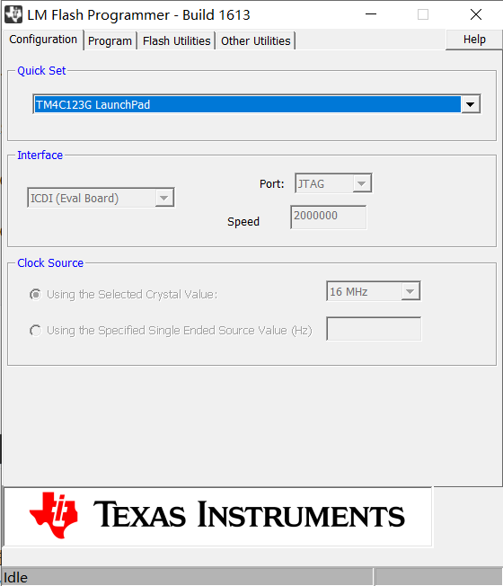

#### 1.2点击Other Utilities ，勾选如下图所示操作

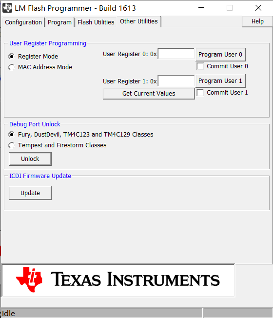

#### 1.3按住板子上的Reset按键，点击Unlock解锁

#### 1.4解锁完成后给板子断电，然后重新上电即可

### 2.芯片引脚默认上锁

https://e2echina.ti.com/support/microcontrollers/other/f/other-microcontrollers-forum/71503/tm4c123g6hpm
